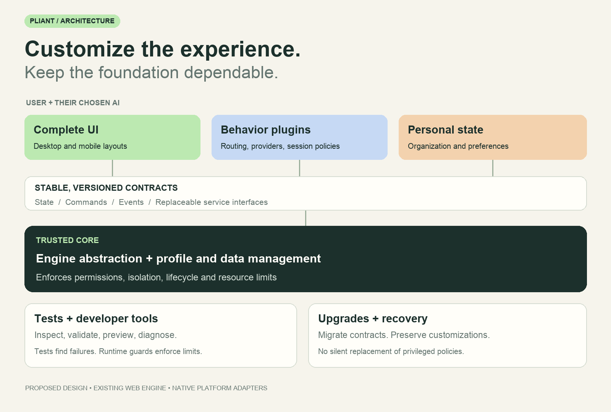

# Design philosophy

[Back to Pliant](README.md) · [Implementation plan](IMPLEMENTATION_PLAN.md)

**Flexibility of customization with safety guards.**

Pliant proposes infrastructure that lets users and their AI build a personal web browser. One or more ready-to-use browsers would offer convenient defaults and demonstrate the same public capabilities available to every user.

This document records the design direction, not implemented guarantees. DSL syntax, engine integration, plugin isolation, and compatibility policy still require design and validation.

**Current first demo:** let users define their own browser independently, quickly, and safely. Prove a real customization and recovery loop without a built-in agent. The AI-native sections below are future ideas to revisit, not prerequisites for this demo.

## Change your own browser's behavior should not need a pull request and wait for approval

You want an Arc-style workspace. Someone else wants a traditional tab bar. You want account-aware routing and a quiet background agent. Someone else wants a different password manager, download policy, or session workflow.

Today, those requests often compete for a place in one product. AI makes the patches cheaper to write. Maintainers still have to choose, integrate, review, and support them.

Pliant proposes a different arrangement:

**The community maintains a stable browser foundation. Users and their AI build the browser experience on top.**

A default browser ships as a useful starting point. Its interface and higher-level services should use the same public contracts available to user customizations. The official design gets no private shortcut that makes an alternative impossible.

## Platform scope

The platform has six responsibilities:

| Component | Responsibility |
| --- | --- |
| Web-engine abstraction | Stable page, rendering, navigation, input, and lifecycle contracts over a Pliant-owned Chromium Content embedder. |
| Profile and data management | Account isolation, passwords, passkeys, cookies, site storage, permissions, history, bookmarks, and session data, with extensible providers and policies. |
| Plugin runtime | Service replacement, event hooks, permissions, resource limits, conflict handling, and failure isolation. |
| Declarative UI engine | A concise language for complete interfaces, state bindings, and interactions, with desktop and mobile layout variants. |
| Validation and developer tools | Comprehensive tests, documentation, types, isolated previews, and diagnostics for users and their chosen coding agents. |
| Upgrades and recovery | Customization packages, versioned contracts, compatibility, migrations, explicit activation, and rollback without requiring AI. |

The developer tools connect the compiler, test suite, and preview environment. They do not require an embedded model or a separate AI-only API. Humans should be able to use the same tools.

Tests find failures; the runtime enforces boundaries; compatibility mechanisms keep customizations usable over time. Exact APIs and implementations remain open.

## More than a sidebar you can theme

The proposal covers both the whole interface and the behavior behind it.

| You ask for… | Your AI would change… |
| --- | --- |
| “Turn my tabs into nested workspaces with a command palette.” | The interface, local organization model, and navigation interactions. |
| “Use these rules to choose an account when I open a link.” | An account-routing plugin, operating within your authorized accounts. |
| “Replace the built-in password manager.” | A credential-provider plugin, subject to explicit permissions and protected credential handling. |
| “Change how research sessions are restored and archived.” | A session-policy plugin and its interface. |
| “Let my agent work in another account without interrupting me.” | A workflow using explicit account contexts and background execution, not simulated profile-menu clicks. |

These are proposed capabilities, not working features. They illustrate the intended customization boundary.

Personal changes stay local unless you choose to share them. They do not need to become a fork of the whole browser or win a maintainer's vote.

## A kernel, not a frozen backend

“Stable platform” must not mean “all important behavior is hard-coded.”

Pliant separates mechanisms from policies, much like a kernel and its applications. Here, **kernel means Pliant's trusted browser core**, not a new operating-system kernel or rendering engine.

The core owns its domain model and invariants. A customization cannot patch that implementation or bypass its constraints. It can extend behavior through explicit interfaces, maintain its own data, and replace services where the contract permits it.

For example, the platform might enforce which accounts a plugin can access while allowing the plugin to choose an account-routing policy. It might protect credential access while allowing different credential providers. Cookie isolation remains mandatory; retention and cleanup policies can be extensible.

The boundary is the design work. A feature does not belong in the core merely because its current implementation lives in a backend file.

## A language for changing the browser itself

We are exploring a **domain-specific language (DSL)** for browser interfaces and interactions. Users could write it directly or ask their AI to modify a preset.

The goal is enough freedom to replace the full browser interface, with enough structure for the platform to inspect and validate the result. A CSS theme or a fixed collection of plugin slots is not that goal.

The DSL would describe layouts, observable state, local presentation models, and event-to-command bindings. Rich behavior plugins would operate through separately permissioned service contracts. They need not share the UI language or its execution privileges.

This distinction matters: arbitrary Swift code does not become safe because its UI uses SwiftUI. A declarative language is not a sandbox either. Runtime enforcement must make the boundaries real.

Pliant will own its embedding layer over Chromium's Content API and selected components, targeting Linux, macOS, and Windows. We reuse Chromium's rendering, networking, storage, and process-security mechanisms, not its full browser application. This [decision](docs/decisions/0001-own-chromium-embedding.md) supersedes the CEF plan and makes us responsible for integration and upstream adaptation; it does not prove that direct embedding is inherently more malleable or safer. Pliant provides its own native UI without Electron. Start with one backend behind stable contracts rather than implementing multiple engines at once. The core language, DSL syntax, native UI framework, and plugin runtime remain open. Compatibility with Chrome/Firefox extensions is explicitly out of scope.

Lightweight operation remains a goal, not a measured result. Building and distributing Chromium infrastructure has a cost; startup time, memory, and power consumption require real measurements. Removing an embedding framework does not automatically reduce those costs.

## Native customization, not extension compatibility

Pliant will not implement the Chrome/Firefox extension compatibility layer or support installing their existing extension packages. This is a product boundary, not merely a lower-priority feature.

Users and their local coding agents should implement changes through Pliant plugins, service providers, and declarative layouts. These may be created locally or reused and adapted from shared Pliant packages; users do not have to rebuild every tool from scratch.

This removes the obligation to reproduce another browser's extension API, but it does not make every extension capability automatically available. Pliant must expose the necessary mechanisms through its own permissioned contracts. Missing capabilities belong in platform design discussions; local code cannot bypass the core to obtain them.

Generating a custom plugin does not require running AI during everyday use. Its permissions, validation, lifecycle, and upgrade rules remain the same whether a human or an agent wrote it.

## One personal browser, different devices (future direction)

A desktop sidebar should not become a miniature sidebar on a phone. Users should be able to import or upload separate desktop and mobile layouts in one personal browser package, or ask their AI to create those variants.

The intended experience shares browser concepts and compatible plugin behavior while allowing each platform its own interface. A desktop layout might use nested workspaces and keyboard commands; its mobile counterpart might use a bottom tab switcher and touch actions over the same logical organization.

The DSL would declare layout variants and required capabilities. Each platform would render the appropriate variant through its native implementation. Plugins would use versioned service contracts, with platform adapters where necessary. A portable contract does not make arbitrary plugin code portable: unsupported capabilities must be reported, and privileged behavior must never be silently substituted.

Sharing a customization package is separate from syncing browsing data. Uploading layouts must not implicitly upload cookies, passwords, history, or account credentials. Package distribution, user-data synchronization, and per-device permissions need separate controls.

Current implementation scope is Linux, macOS, and Windows. Mobile support is deferred; the examples above describe a future direction, not current delivery commitments.

## Two promises the architecture has to earn

### 1. Change your experience without becoming a browser QA team

Your AI should not have to rediscover every edge case each time it moves a button or replaces a workflow.

A custom close action should call the platform's close operation rather than reimplement page teardown and required confirmation. A custom tab picker should work on a PDF or internal page without injecting itself into that document. A plugin that crashes should not take your session data with it.

The proposed validation path is:

**Describe → generate a local change → check contracts and permissions → test in isolation → preview → explicitly enable → undo.**

The platform should supply lifecycle and compatibility tests, including scenarios the customization author did not anticipate. Permission enforcement, resource limits, and an independent recovery interface must remain outside the customization's control.

This cannot prove every possible interface correct. The target is enforceable core invariants, bounded failures, and recovery without data loss. Undoing a customization does not undo an email, purchase, or other external action it already triggered.

### 2. Keep your browser current without surrendering your customizations

Your UI must depend on a stable contract, not a Chromium internal class or the current password database layout.

The foundation should handle engine changes, storage migrations, and system integration behind that contract. Compatibility adapters and deterministic migrations should handle supported upgrades without an AI call. AI can help when a customization needs redesign; it must not be required for ordinary upgrades or everyday browsing.

If a UI customization cannot run on a new version, the browser should preserve it and offer a safe default interface. An incompatible credential provider, account-routing policy, or other privileged plugin requires different handling: stop affected operations and ask for explicit approval before substituting a service or policy. A UI fallback must never silently change account, credential, or privacy behavior.

**A personal sidebar must never hold a security update hostage.** Updating the foundation must remain possible even when affected plugin operations are disabled.

Stable contracts do not mean immutable implementation. They mean deliberate versioning, supported compatibility windows, and explicit handling of breaking changes.

## Agents are native participants, not only code authors

**Future direction, deferred from the first customization demo.** Agent implementation, model/data policy, and external coding-agent collaboration are not current decisions or work items.

Pliant should ship a built-in agent service that improves everyday browsing and collaborates with the user's coding agent. Supporting an external agent connection is not enough. AI should participate in browser behavior, not merely add a chat box to the interface.

### Improve everyday browsing

With the user's permission, the built-in agent can use current content and browsing behavior to anticipate useful actions. It might predict a likely next URL and request preloading, recommend related content, or help organize an ongoing browsing session. These examples illustrate the goal; they do not define its limits.

The agent should work with browser services in both directions: consume relevant events and context, and provide assistance that those services can use. Routine improvements should not require a chat prompt. Browser input and navigation must not wait for a model response; inference should use bounded background work and reuse results where appropriate.

Prediction is separate from execution. For example, the agent proposes preload candidates; the page service and engine decide whether and how to load them safely. Speculative loading can make network requests and expose browsing intent. It must respect account boundaries, privacy settings, resource budgets, and restrictions on prerendering and external effects.

### Help the browser grow through use

The built-in agent should help users express what they want to change, using authorized knowledge of their current browser and workflow. It should turn an incomplete request into a clearer goal through dialogue, not force users to write a complete implementation prompt themselves.

The user's coding agent should be able to exchange questions, scoped context, proposed changes, and preview results with the built-in agent. The built-in agent contributes browser context and user feedback; the coding agent implements changes through the customization toolchain. Neither agent substitutes its own agreement for the user's authority.

The intended loop is: use the browser, identify a need, clarify it together, implement a change, try it in a preview, refine it, and enable it. Relevant context is shared explicitly; collaboration does not grant the coding agent unrestricted browsing history or credentials. Activation and rollback remain platform operations, not model promises.

### Participate through native service contracts

A runtime agent should run as a separate process and register with the platform through Mojo inter-process communication (IPC). The trusted platform admits the process, establishes its identity, and grants access to specific Pliant service interfaces. The agent can then call those services directly through typed Mojo interfaces, without driving the human's UI. It can also provide a service where the platform contract permits it.

Registration and service discovery do not grant unrestricted access. Services must enforce the agent's granted scope, including account and page boundaries, and support revocation. Mojo supplies communication, not Pliant's service registry, authorization policy, or a complete security boundary. Process separation alone does not replace sandboxing and permission enforcement.

Agents should depend on versioned Pliant contracts, not arbitrary Chromium-internal Mojo interfaces. Direct service calls need not pass through a central agent controller, but they must preserve platform authorization and operation tracking. Users must be able to inspect agent activity and stop further access without closing their own browsing session.

The built-in experience is a product responsibility, not a requirement to use one fixed model, agent implementation, or chat interface. Users should be able to replace or disable the agent. Ordinary browsing and previously generated customizations must continue to work without a running agent.

This is a platform design direction, not an implemented capability or an addition to the initial embedder MVP.

## Human and agent, at the same time

Pliant is intended for people and agents sharing a browser without fighting over focus.

Both should use the same underlying account, page, and operation model. An agent gets explicitly granted capabilities and exact task targets. It should not need to drive the human's UI to reach browser functionality. The user retains control of their active window and can pause, inspect, or take over agent work.

Separate tabs do not isolate server-side effects. Two actors editing the same cart or draft still need coordination. A custom interface cannot make that problem disappear.

## What belongs in the upstream repository?

The most valuable design discussions should ask:

- Which invariant must every browser experience preserve?
- Which policy or service should users be able to replace?
- Which missing capability forces customizations to reach into internal code?
- How does an existing customization survive the next platform release?

UI presets and behavior plugins can have their own repositories and release cycles. Upstream remains responsible for the core, contracts, engine integration, and the quality of its defaults.

This does not eliminate maintenance. It stops making one maintainer queue the only route to a different browser experience.

## The first proof should be concrete

Before designing a universal framework, test a small vertical slice:

- Run two substantially different browser interfaces on the same core.
- Replace one meaningful behavior service through a plugin, not an internal patch.
- Exercise missing pages, denied permissions, plugin failures, and background account access.
- Upgrade the foundation and run the old customization unchanged, without AI.
- Demonstrate a recoverable incompatible customization without blocking the foundation's update.

These are proposed acceptance criteria, not completed milestones.

## Help define the boundary

Bring a browser behavior you cannot customize today. Describe the experience you want, the core capabilities it requires, and what must remain correct if your implementation fails.

The difficult questions are welcome: plugin composition, conflicts between policies, credential-provider trust, compatibility windows, and how much a DSL can express before it becomes another unrestricted programming language.

Pliant builds on established ideas in extensible systems and [malleable software](https://www.inkandswitch.com/essay/malleable-software/). Its bet is applying them to the entire browser experience with AI as an everyday author, rather than reserving customization for extension developers.

**The browser you use should be a design you can change, not a decision you have to live with.**

---

Concept by [Yifan Li](https://github.com/yifanswe).

Drafted and sent by Yifan's personally built AI assistant.
