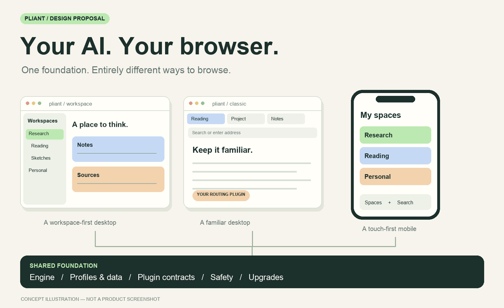

# Pliant

**Infrastructure for your Coding Agent to build your browser.**

[Design philosophy](DESIGN_PHILOSOPHY.md) · [Implementation plan](IMPLEMENTATION_PLAN.md) · [Module map](MODULES.md) · [Discuss an idea](https://github.com/yifanswe/pliant-browser/issues)

Pliant proposes a browser-building platform where users and their AI can replace the **entire interface and browser behavior**, without forking the foundation.

We also plan to provide **one or more ready-to-use browsers**: convenient defaults and reference implementations built through the same public interfaces available to everyone.

The repository includes a [module scaffold](MODULES.md), an accepted decision to
[own the Chromium embedding layer](docs/decisions/0001-own-chromium-embedding.md),
and a pinned Chromium source baseline. There is no working browser or
engine integration yet. The core language, native UI framework, UI DSL, and
plugin runtime remain open.

## Customization with safety guards

**No Chrome/Firefox extension compatibility by design.** Users customize Pliant through its own plugins and declarative layouts, written directly or with their local coding agent.

Make an Arc-style workspace, a traditional tab bar, or your own desktop layout. Replace account-routing policies, credential providers, and session workflows through plugin contracts. Personal choices should not need an upstream PR.

The core should enforce safety boundaries while users change their experience. Infrastructure upgrades should remain possible **with or without AI**, independent of personal customizations.

## What we plan to provide

| Component | Purpose |
| --- | --- |
| **Web-engine abstraction** | Stable browser capabilities over a Pliant-owned Chromium Content embedder. |
| **Profile and data management** | Isolated accounts, cookies, passwords, permissions, and persistent data. |
| **Plugin runtime** | Extensible services and behavior with permissions and failure isolation. |
| **Declarative UI engine** | A concise DSL for complete interfaces and platform-specific desktop layouts. |
| **Tests and developer tools** | Comprehensive validation, isolated previews, and diagnostics for users and their AI. |
| **Upgrades and recovery** | Versioned contracts, migrations, and safe recovery without relying on AI. |

## Help shape Pliant

The engine direction is **our own embedding layer over Chromium's Content API and selected components**, targeting **Linux, macOS, and Windows** with native UI, without Electron. We reuse Chromium's web infrastructure, not its complete browser application or CEF. Mobile is deferred. DSL syntax, native UI framework, and plugin execution remain open decisions.

Bring a browser experience you want to build. The useful question is **which capabilities should the platform guarantee, and which decisions should users control?**

Read the [design philosophy](DESIGN_PHILOSOPHY.md) for the architecture, safety boundaries, and proposed acceptance criteria.

---

Concept by [Yifan Li](https://github.com/yifanswe).
