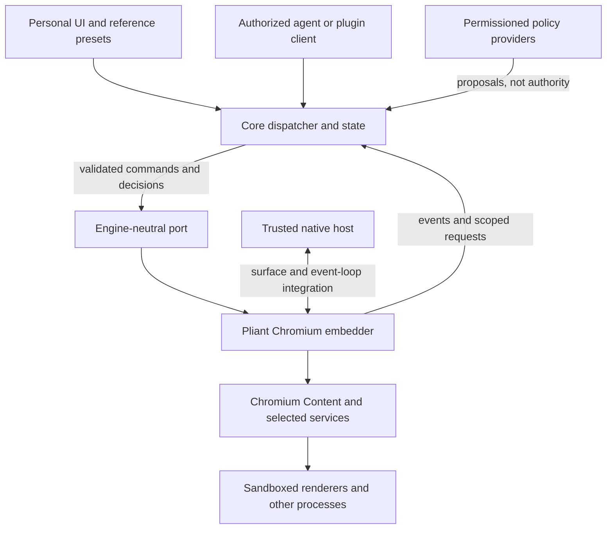

# Pliant embedder v0

**Status:** proposal for review, 2026-09-17. The API names and semantics below
are a design, not implemented interfaces or a stable ABI. Runtime behavior,
native integration, and security guarantees still require real-browser evidence.

[Module boundary](README.md) · [Decision](../../docs/decisions/0001-own-chromium-embedding.md) · [Philosophy](../../DESIGN_PHILOSOPHY.md) · [Capability evidence](../../docs/contracts/engine-capabilities.md)

## 1. The model in one minute

The embedder is a **trusted web-content service**, not a browser UI framework
and not a plugin runtime. It makes Chromium usable through Pliant-owned
mechanisms; core decides who may use them and which service supplies policy.

The basic flow resembles CEF:

1. Start one engine runtime in the native host; initialize Chromium's child-process entry points as required.
2. Open an explicit engine context for a core-selected profile.
3. Create a live page in that context. It initially contains a blank document and does not activate a window.
4. Attach its content view to a native surface when presentation is needed.
5. Navigate the page; observe state changes and handle requests through core.
6. Close pages, release contexts, and shut down in that order.

The critical distinction is **page != tab != surface != task**. A page can move
between layouts without changing account context or reloading. A task can own
several pages without owning the human's window. A preset can reorganize pages
without acquiring direct engine authority.

### Familiar CEF concepts, different public boundary

| CEF concept | Proposed Pliant equivalent | Deliberate difference |
| --- | --- | --- |
| Application/process callbacks | `EngineRuntime` and trusted `EngineHost` | Only trusted bootstrap code runs here; no personal-package initialization in renderer/helper processes. |
| Request context | `EngineContext` | An explicitly selected profile, no global/default account fallback. Context lifetime is independent of windows and tasks. |
| Browser | `PageRef` | A live content instance, not a tab widget or permanent Chromium identifier. |
| Frame | `DocumentRef` | Exact frame-document and activation identity, not a raw frame pointer that may survive a navigation. |
| Native browser view | `ViewRef` bound to a `SurfaceLease` | Presentation and foreground activation are separate from page creation and navigation. |
| Client/handler callbacks | Events, pending requests, and fast decision snapshots | Observation cannot authorize an action. Slow policy services are never called synchronously from an engine hook. |

We borrow the model, not CEF's API/ABI, Views toolkit, browser styles, or code.
This module uses Chromium's Content interfaces directly.

## 2. Two APIs, not one unrestricted browser SDK

**Public Pliant API:** UI, plugins, and agents use core identities, grants,
commands, and filtered observable state. Core owns this versioned contract.

**Trusted engine port:** core and the native host use the operations in this
document. Core defines the engine-neutral port; this module implements it.
Possessing an engine handle is not authorization. The port is not exposed to
untrusted package code, a web page, or a remote debugging client.



This is a runtime interaction diagram, not permission for core to import
Chromium or for the embedder to import a platform implementation. Native
facilities are injected through host interfaces; see [MODULES.md](../../MODULES.md).

The first version uses an in-process trusted core/engine boundary. That boundary
is an ownership/API boundary, **not a sandbox against malicious native code in
the same process**. Untrusted plugin execution requires the separate plugin
runtime. Chromium's renderer sandbox and origin checks remain in force.

## 3. Object and identity model

| Object/value | Owner and lifetime | Meaning |
| --- | --- | --- |
| `EngineRuntime` | Native bootstrap; one initialized runtime per host process lifetime | Chromium services, engine sequence, context registry, and event delivery. No arbitrary initialize/shutdown/reinitialize cycle. |
| `ProfileId`, `PageId`, `OperationId` | Core | Pliant identities. Persistence, restoration, actor access, and task membership are core concerns. |
| `ContextRef` | Embedder; from context open until release | Opaque live-context handle associated with one `ProfileId`. Includes runtime/incarnation identity internally. |
| `PageRef` | Embedder; from page creation until destruction | A `PageId` bound to one live page incarnation and one immutable `ContextRef`. |
| `DocumentRef` | Embedder; valid for a frame's current, active document | Includes page incarnation, frame-document identity, and activation generation internally. Used for document-sensitive work and requests. |
| `SurfaceLease` | Trusted platform host, registered for core-approved hosting | A native container and its lifetime, not a window-selection policy or a plugin-supplied pointer. |
| `ViewRef` | Embedder and platform host through an explicit attachment | A page-to-surface binding with a geometry revision. It does not own the page's browsing identity. |
| `ViewportRevision` | Embedder; changes when a page's input coordinate space changes | Geometry belongs to the page even while unpresented. It is distinct from a native attachment, so background targeting does not need a fabricated window. |
| `RequestRef` | Embedder; until resolution, expiry, or invalidation | One pending engine request and its private Chromium continuation. |
| `DownloadRef` | Embedder; context-scoped | A transfer can outlive its initiating page. Closing the page does not silently cancel an authorized download. |

All live references are opaque, typed, process-local values. They are not
serialized into personal packages or reused after a runtime restart. Core may
restore the same logical `PageId`, but the new `PageRef` has a new incarnation;
old commands fail with `StaleReference` rather than targeting the replacement.

### Contexts and storage

For v0, use **one custom `content::BrowserContext` per open profile context**.
Use its default storage partition for ordinary browsing; additional upstream
partitions are implementation details, not an exposed account-selection API.
Different contexts must not share storage backing accidentally. A second live
open of the same profile is rejected; core shares the existing context instead.

`ContextOptions` selects either `Persistent(StorageAllocation)` or `Ephemeral`.
Core supplies the allocation through trusted storage facilities. Paths and raw
Chromium preferences never come from a layout or plugin. Canonical allocation
ownership, duplicate opens, and incompatible data versions are checked before
creating engine services.

Ephemeral means no intentional persistence of that context's browsing data;
it is not a claim that the OS never swaps memory or that downloads cannot write
explicitly authorized files. Chromium's cookies, caches, databases, and service
worker storage remain upstream implementations.

`BrowserContext` is not one renderer process. Multiple contexts still share
trusted browser-process infrastructure; this is not isolation from a compromised
host process. Keep Chromium's process/site isolation rather than inventing a
one-page/one-process or one-profile/one-process guarantee.

### Documents, frames, and navigation

A `PageRef` survives normal navigation; a `DocumentRef` does not confer access
to whatever document happens to be there later. Cross-document navigation,
frame replacement, renderer loss, or leaving the active document invalidates
document-sensitive work. Restoring a cached document issues a fresh activation
generation so an old queued action does not unexpectedly become valid again.
`DocumentActivated` reports that new reference; input using the pre-restore
reference fails `StaleReference` even if Chromium restores the same document.

Same-document navigation updates the URL/state without pretending a new document
was created. Sensitive decisions recheck current origin/context and policy even
when document identity has not changed. V0 observation and input target the
primary document; subframe requests still carry their actual requesting document
and embedding context. General cross-frame automation is not implied.

This recheck occurs at the privileged action/query, not by intercepting every
URL change. V0 permission/admission snapshots are origin/document-scoped, not
path-routing rules. A history/hash change neither grants authority nor changes
profile; no universal veto over same-document navigation is promised.

## 4. Proposed API shape

The following signatures are language-neutral notation. `Op<T>` means immediate
admission or rejection followed by an asynchronous terminal result; it is not a
promise that Chromium has a matching function. No Chromium, OS, or Rust/C++ ABI
types appear in the core-facing value model.

Every operation submission also carries a `CommandHeader` with a **core-assigned
`OperationId`**, omitted from the tables for readability. Core records the real
caller/task and authorization before submission. The engine echoes this ID but
does not trust an actor label as a grant. IDs are unique within the runtime and
duplicates are rejected, never replayed; a retry is a new authorized operation.

### 4.1 Runtime and contexts

| Operation | Contract |
| --- | --- |
| `RunEngine(LaunchConfig, HostFactory) -> ExitStatus` | Called at process entry through native bootstrap. Handles the appropriate browser/helper role and event loop; `HostFactory` constructs core only in the browser role. Returns when the process role exits. |
| `EngineHost.OnReady(EnginePort, EngineInfo)` | Gives trusted core access after initialization. No page/context commands before this point. |
| `Describe() -> EngineInfo` | API version, Chromium/build identity, compiled capabilities, limits, and validated platform configurations. Available API and tested support are distinct fields. |
| `OpenContext(ProfileId, ContextOptions) -> Op<ContextRef>` | Open exactly the requested allocation/mode. No fallback profile, storage path, or silent format downgrade. |
| `ReleaseContext(ContextRef) -> Op<ReleaseReport>` | Reject with `Busy` while pages, downloads, or unresolved host requests still require the context. After admission, reject new work, stop context background activity, and drain engine teardown. |
| `RequestShutdown() -> Op<ShutdownReport>` | Core first closes pages and releases contexts. Reject if resources remain; orderly shutdown does not force-close user data or silently approve unload prompts. |

`LaunchConfig` contains trusted resource/helper locations and bounded diagnostic
and resource settings. It does not expose `disable_sandbox`, single-process mode,
arbitrary Chromium switches, or a debugging port to personal packages.

The embedder and platform use Chromium's native message-loop/task-runner
integration. V0 does not promise a portable manual `Pump()` method or support
for an arbitrary UI event loop before that integration is demonstrated.

### 4.2 Pages and navigation

| Operation | Contract |
| --- | --- |
| `CreatePage(PageId, ContextRef, PageOptions) -> Op<PageRef>` | Create a blank live page in one context, initially unpresented. No automatic native window, navigation, or OS focus. |
| `Navigate(PageRef, NavigationSpec) -> Op<NavigationOutcome>` | Browser-initiated navigation to a parsed URL. V0 exposes normal GET navigation, not arbitrary request bodies, forged origins, or unrestricted headers. |
| `TraverseHistory(PageRef, offset) -> Op<NavigationOutcome>` | Navigate the page's actual history; an absent entry fails explicitly. This is not global history or session restoration. |
| `Reload(PageRef, ReloadMode) -> Op<NavigationOutcome>` | Normal/cache-bypass reload as supported; required form-repost confirmation remains a host request. No silent POST replay. |
| `StopLoading(PageRef) -> Op<StopReport>` | Stop the page's current load activity when dispatched. It is a page-wide stop command, not an exact cancellation of a previous navigation. |
| `ClosePage(PageRef) -> Op<CloseOutcome>` | Run required beforeunload/unload handling. Result is `Closed`, `Refused`, or a reported failure, not merely “close requested.” |
| `SetPagePreferences(PageRef, PagePreferences) -> Op<void>` | Initially limited to supported presentation controls such as zoom and audio mute. No arbitrary Chromium preference dictionary. |

`CreatePage` has no initial-URL parameter in v0; ordinary host-created pages
start at `about:blank`. `PageOptions` declares initial viewport and bounded
resource limits, not tab position, folder membership, account-routing rules,
or task semantics. The
context binding is immutable. Opening the same URL in another account means a
new page/context choice through core, not editing a live page's identity.
`Navigate` does not rerun account routing: it stays in the target page's context.

Keep creation and navigation separate. A core-level convenience operation may
combine them, but creation can succeed while navigation fails; neither failure
must leave an unattributed page or be reported as a completed load.

`NavigationOutcome` distinguishes `Committed`, `SameDocument`, `NoDocument`
(for example a no-content response), `BecameDownload`, `Failed`, `Cancelled`,
and `Superseded`. A committed error document is an error outcome with its actual
state, not successful loading of the requested page. Each navigation attempt
has its own identity; there may be overlapping attempts even in one frame.

Navigation operations terminate at a defined navigation outcome, **not network
idle or “the website is finished.”** Document loading is observable separately.
Cached restores and same-document transitions need not emit a fresh load event.

V0 handles public web URLs and the blank document. File access, internal pages,
external protocols, custom schemes, and certificate exceptions are separate
privileged capabilities, not implicit consequences of accepting a URL string.
Web-origin security and normal engine-mediated subresource behavior still apply.

### 4.3 Native presentation and input

| Operation | Contract |
| --- | --- |
| `AttachView(PageRef, SurfaceLease, ViewState) -> Op<ViewRef>` | Attach the existing content view to an authorized native container without activation. At most one live interactive attachment per page in v0. |
| `UpdateView(ViewRef, expected_revision, ViewState) -> Op<ViewRevision>` | Update bounds, scale, and visibility with explicit coordinate conventions. Reject stale attachment/geometry revisions. |
| `DetachView(ViewRef) -> Op<void>` | Release the attachment and native references; the page stays alive, unpresented. The host must not destroy a leased container before detach completes. |
| `SetViewport(PageRef, expected_revision, ViewportState) -> Op<ViewportRevision>` | Set geometry for an unpresented page. When a native view is attached, its geometry is authoritative and this command fails `Busy`; changes through that view also advance the page viewport revision. |
| `RequestFocus(ViewRef, FocusIntent) -> Op<FocusOutcome>` | A separate core-authorized action: focus within the existing foreground window or explicitly request activation. Report actual platform outcome; never smuggle this into navigation. |
| `SendInput(DocumentRef, ViewportRevision, InputEvent) -> Op<InputOutcome>` | Page-scoped pointer, wheel, key, or text input through the engine's supported path, including unpresented pages only when supported. Reject stale targets/coordinates. Dispatch completion is not proof of a DOM change or remote success. |

`ViewState` uses logical viewport coordinates plus explicit device scale and
visibility. Platform integration performs OS coordinate conversion. The
embedder renders the website; Pliant lays out the native container and its own
browser chrome. No page pixels need to cross the core event stream.

Native user input already routed to the registered view need not round-trip
through a plugin or UI command dispatcher for every keystroke. Its surface
binding, focus ownership, and lifetime are trusted host responsibilities. Agent
input does go through core authorization and exact engine targets.

For viewport input, the primary `DocumentRef` is a stale-document guard, not an
atomic DOM-element target. Chromium still performs hit testing and frame routing;
content or subframes can change before an event is handled. V0 does not promise
that coordinate input reaches a previously observed element. Document changes
after dispatch are reported, not undone.

**Background is not a focus flag.** A background page must not activate the
human's window, change the selected page, or steal the OS input responder.
Document-local input focus and native application focus are different concerns.
Hidden content may be throttled or not painted; v0 does not promise active-tab
performance or a bitmap for a never-presented page.

Expose `background_input` only after the real native scenario passes. If an
operation requires foreground interaction, return `NeedsForeground` and let
core arrange a handoff. Do not synthesize global OS clicks or fake a user gesture
to bypass a web-platform permission rule. OSR, arbitrary transforms, simultaneous
mirrors of one page, and semantic DOM automation are separate future capabilities.

Unexpected loss of a native container emits `SurfaceLost`, revokes that view's
input binding, and leaves page cleanup to core. Moving from a sidebar preset to
a tab-bar preset must not, by itself, close or recreate the page.

### 4.4 Host decisions and observations

| Operation/interface | Contract |
| --- | --- |
| `PublishPermissionSnapshot(ContextRef, expected_revision, snapshot) -> Op<Revision>` | Install core-validated, typed site-permission decisions for synchronous queries. Notify affected engine permission subscriptions when state changes. |
| `PublishPageRules(DocumentRef, expected_revision, rules, popup_slots) -> Op<Revision>` | Install bounded admission/presentation rules and core-reserved child-page slots for synchronous hooks. Rules are scoped to the current document, not arbitrary executable plugin code. |
| `ResolveRequest(RequestRef, TypedDecision) -> Op<ResolutionReceipt>` | Validate kind, current scope, liveness, and policy revision; consume the private continuation once. Receipt means applied/rejected, not that the resulting operation succeeded. |
| `InvalidateRequests(RequestRef[], reason) -> Op<InvalidationReceipt>` | Cancel exactly the still-pending requests selected by core, for example on grant/provider revocation. Report requests already resolved rather than claiming to undo them. |
| `CancelDownload(DownloadRef) -> Op<DownloadOutcome>` | Stop an identified transfer where possible and report the partial/completed state. No implication that previously transferred data or remote effects disappeared. |
| `EngineHost.OnEvent(Event)` | Observe immutable state changes, requests, and operation results on the host delivery sequence. No Chromium pointers or borrowed callbacks escape. |
| `ReadState(Target) -> Op<StateSnapshot>` | Obtain current engine state and its sequence watermark, especially after attaching/recovering a UI. Core filters state for the actual caller. |
| `CancelOperation(OperationId) -> Op<CancelReport>` | Cancel the identified operation where possible. Never implement exact cancellation by blindly stopping whichever new navigation now occupies the page. |

Snapshots contain typed decisions, not an arbitrary rules language or a hidden
second plugin runtime. Core validates provider output and converts it into
enforceable data. Updates use expected revisions so an old provider result
cannot overwrite a newer revocation or policy change.

The embedder independently enforces the published `EngineInfo` limits on size,
entry/slot count, and pending requests. Reject oversized/invalid updates before
installation; never truncate them into a different policy or execute provider
code. New contexts/documents start with conservative empty snapshots. A failed
update leaves the old revision installed and reports failure; core must not
report a revocation complete until its valid update/invalidation is acknowledged.

## 5. Three kinds of engine notification

### Observation: no decision required

Examples are page created/closed, URL/title/security state, navigation progress,
document activation, loading state, audio state, view loss, renderer failure,
and operation completion. An observer cannot change the event's historical
outcome or gain authority by returning a value.

Events carry a runtime sequence, relevant context/page/document references, and
an operation correlation ID when known. Engine-originated activity is not
automatically attributed to the last agent command; report an unknown or
page/worker source instead of inventing causality.

### Deferred request: an explicit continuation exists

The embedder retains Chromium's continuation and emits a `RequestRef` with:

- A typed request kind and allowed response variants.
- Its context and real source: a frame document or context/worker activity. Never invent a page for a worker-originated request.
- Canonical requesting and embedding origins where applicable; opaque origins are not collapsed into one interchangeable `null` string.
- Relevant engine-reported user activation, policy revision, expiry, and the pending operation if known.
- Only the information needed to decide. Sensitive file/credential data uses protected host values, not general UI state or logs.

`OriginKey` is either a canonical scheme/host/port tuple or an opaque,
runtime-scoped identity. Opaque grants cannot be persisted by serializing a
display string, and no raw Chromium nonce needs to become public UI state.

Core invokes the selected provider or a trusted prompt, rechecks authority, then
calls `ResolveRequest`. Default outcomes are safe denial/cancellation. Missing
providers and timeouts never mean “use a different account” or “allow.”

| Request | V0 response and failure behavior |
| --- | --- |
| Site permission | Typed allow/deny/dismiss for the capabilities actually integrated. Pliant caller grants, website permission, and OS/device permission must all hold; one cannot substitute for another. |
| JavaScript alert/confirm/prompt | Acknowledge, cancel, or supplied prompt text as appropriate to the kind. Per-page quotas prevent prompt storms. Dialog text is untrusted content, not instructions. |
| Beforeunload or form repost | Explicit proceed/cancel. An unanswered request leaves the destructive/replay action cancelled; it is not an excuse to force the action. |
| File upload | A scoped platform file-selection lease or cancellation, not arbitrary paths supplied by a plugin. Reject stale document or expired file grants. |
| Download authorization/destination | Explicit allow/deny and a validated output allocation. No automatic overwrite, execute, or open-after-download. Progress and failures have their own events. |

Permission kinds needing unimplemented device/services return a defined denial
and `Unsupported` diagnostic; the existence of a generic request type does not
claim every web permission works. V0 does not implement a password provider,
HTTP/client-certificate credential workflow, or passkey stack by inventing a
generic secret-string callback. Those need dedicated protected-data contracts.

Requests end exactly once: applied, denied, expired, cancelled, or invalidated.
A later duplicate response returns `AlreadyResolved`/`Expired`/`StaleReference`.
Navigation, policy revocation, frame loss, or shutdown invalidates affected
requests. Already authorized downloads have their own context-scoped lifetime;
document closure does not retroactively undo bytes already transferred.

Every deferred request has a finite monotonic deadline, bounded by trusted
runtime limits. Expiry consumes the continuation with the safe response; for
beforeunload this cancels the close and reports `Refused`. Late replies cannot
revive it. A pending prompt does not block the engine event loop indefinitely.

Snapshot updates, explicit invalidations, and request resolution are ordered on
the engine sequence. Installing a restrictive revision invalidates affected
pending continuations and emits `RequestInvalidated` before acknowledging the
new revision. A resolution processed first may already have taken effect; the
receipt reports that boundary instead of claiming instantaneous rollback. The
engine knows policy revisions/scopes, not plugin-provider identity or policy.

### Immediate hook: no slow callback is allowed

Some Chromium hooks return a value synchronously. They read the installed,
core-validated snapshot on the engine sequence. They must not wait for IPC,
plugin execution, network access, or human input. No matching rule means the
defined conservative result, with an observable reason.

Popup creation is the important example:

1. Core reserves a bounded set of child slots, each with a new `PageId`, an ownership record, and permitted non-activating hosting, before a document may open children.
2. The synchronous creation hook checks the current document/rules, user-activation requirements, context binding, quota, and available slot. It either admits a child in the opener's context or denies creation.
3. The embedder installs delegates, adopts the engine-created child, and fulfills required native attachment before the upstream callback returns. No unsolicited foreground window is created.
4. `PageCreated` reports the consumed slot and opener to core. Failed creation returns/releases its reservation. UI presentation is a later core decision.

Slots have an explicit `Reserved -> Consumed | Released` lifecycle. A reserved
ID is never simultaneously used for another page; after expiry or failed
adoption, core reclaims capacity with a fresh ID, not by recycling a potentially
referenced child identity. Rules revision/document invalidation releases unused
slots. No slot means denial, not an unattributed engine-created page.

This preserves Chromium's opener, session-storage, and navigation semantics. Do
not cancel a popup and later pretend that opening its URL as an unrelated page
was the same operation. Routing a user-selected link to another account is a
separate core operation; it does not transplant an existing popup or preserve a
cross-context opener relationship. If synchronous safe hosting is unavailable,
block and report it rather than promise universal asynchronous popup approval.

## 6. State, completion, threading, and lifetime

### Observable state is not the engine's object graph

A page snapshot includes its identity/context, lifecycle, visible and committed
URLs, title, navigation/back-forward state, active document, loading/security
state, audio state, and attachment/visibility information. Requested URLs and
committed origins remain distinct so a UI does not misrepresent site identity.
No DOM, cookies, credential values, or raw Chromium objects are part of this
general state. Core restricts even ordinary metadata by page/profile grants.

### Admission and completion

Every command either rejects before admission or registers its core-supplied
`OperationId` and reserves event capacity. Accepted operations produce one
terminal outcome while the runtime and host connection remain live.
Acceptance is not completion. Browser
process loss makes in-flight results `Unknown/EngineLost`, not successful or
definitely cancelled. No exactly-once remote-effects guarantee is made.

The engine records the submitted core `OperationId` before invoking upstream
code, which may call observers reentrantly. It correlates the resulting
navigation attempt and its redirects with that operation. Other page-initiated
attempts get separate navigation identities and no invented caller attribution.
Superseding navigation or page closure settles affected operations before
discarding late raw callbacks; it never drops the promised terminal outcome.
Renderer loss is `RendererLost` for affected work, distinct from host-process
`EngineLost`.

Cancellation reports `CancelledBeforeDispatch`, `CancellationRequested`,
`AlreadyFinished`, or `NotCancellable`. A request to cancel is not a terminal
result until the actual outcome is known. If Chromium cannot cancel just that
navigation, report the limitation; `StopLoading` is a separately authorized,
page-wide action and must not cancel an unrelated replacement navigation.

Progress state can be coalesced. Request creation/invalidation, terminal
operation results, and object destruction must not be silently dropped. Bound
queues and outstanding work; reject new work as `Overloaded` before exhausting
resources. State snapshots provide a sequence watermark for resynchronization,
not a command-replay mechanism.

`ReadState` is serialized on the engine sequence. Its snapshot reflects state
through watermark `s`; consumers apply later state events with sequence greater
than `s`, while separately handling all request/operation-result events. Engine
or host-connection loss invalidates the stream and its handles; a snapshot cannot
recover unknown external side effects or safely replay pending commands.

Representative errors are `InvalidArgument`, `StaleReference`, `ContextClosing`,
`Busy`, `Unsupported`, `PolicyOutOfDate`, `NeedsForeground`, `Expired`,
`AlreadyResolved`, `Overloaded`, and `EngineLost`. Keep stable semantic errors
separate from private upstream codes used for trusted diagnostics.
Storage failures use explicit reasons such as `StorageUnavailable`,
`AllocationInUse`, or `IncompatibleData`; failure to open persistent storage
does not substitute an ephemeral context or another profile.

### Thread contract

- The context/page registry and its Content browser objects live on Chromium's browser/UI sequence. Public commands copy values and marshal there rather than expose thread-affine objects. Network, storage, renderer, and other services retain their own upstream sequence requirements.
- Host events are delivered in order after the initiating engine callback unwinds; observers must not block the engine thread. Reentrant commands are queued, not executed inside an upstream callback.
- Synchronous hooks only read bounded decision data/reservations. Slow provider work happens outside the engine hook and returns through the command path.
- Destruction and continuation invalidation happen on the owning sequence. Worker-thread completion uses weak/liveness-checked targets; no callback captures an unbounded raw page pointer.
- Native main-thread requirements are explicit in the platform bridge. A Rust async executor cannot replace Chromium/AppKit event-loop requirements.

### Lifecycle outcomes

| Object | Transitions and failure behavior |
| --- | --- |
| Runtime | `Starting -> Ready -> Quiescing -> Stopped`, or `Failed`. No new commands after shutdown admission except completion/drain handling. |
| Context | `Opening -> Open -> Releasing -> Released`. No creation or new services during release. Failed release reports the actual remaining state; it does not license deleting live data. |
| Page | `Creating -> Live -> Closing -> Closed`; unload refusal returns to `Live`. Repeated concurrent close requests join one close attempt rather than prompting twice. A closed incarnation stays invalid. |
| Renderer/document | Failure invalidates affected document targets and requests. The page can remain as a failed content instance for inspection/recovery; it is not automatically replaced or reloaded. |
| Attachment | `Attached -> Detaching -> Detached` or `SurfaceLost`. Detaching presentation does not destroy the page. |

Core owns a **separate, explicitly authorized recovery path** for aborting
unresponsive pages/processes. No ordinary close API exposes a casual
`force=true` option to presets. A process kill can affect multiple pages and
must report that scope; it is not a page-local cancellation guarantee.

Before context destruction, all pages and context-dependent delegates/services
must reach their required teardown points, including downloads and storage
partitions. Closing the last tab alone does not prove that service workers or
network/storage work have stopped. Start with offline backup/migration after
complete engine shutdown; v0 does not promise an online consistent profile copy.

## 7. How this implements the philosophy

| Replaceable choice | Mechanism that remains invariant |
| --- | --- |
| Sidebar, horizontal tabs, command palette, or split layout | All layouts refer to core pages; view attachment cannot change identity or account. Split layout uses several page views, not a special engine workspace model. |
| Account-routing service | Provider proposes a profile; core validates access before creating a context/page. No unauthorized profile enumeration or implicit fallback. |
| Site-permission or download policy | Provider supplies a proposal; core validates it; scoped engine decisions enforce liveness and origin/context constraints. |
| Session organization/restoration | Core/policy chooses what to restore; the engine creates new incarnations. History replay and restored UI state do not authorize remote writes. |
| Human versus agent workflow | Both use core operations; task attribution remains in core. Explicit input targets and presentation/activation separation prevent using the human's UI as the transport. |
| UI/plugin upgrade | Public package contracts evolve independently from private Chromium interfaces. Incompatible privileged providers block affected work; a UI fallback cannot silently change policy. |

Malleability means **different policies over dependable mechanisms**, not every
Chromium preference becoming user-editable. The trusted recovery interface,
origin security, data isolation, and permission enforcement cannot be replaced
by a layout. Official presets use the same public core API as personal ones.

### Example: open and work without selecting the human's tab

Conceptual core-side use, not a proposed user/plugin bypass. Each engine call
also receives the core's command header; it is elided here for readability:

```text
profile = core.authorize_routing_result(caller, routing_service.choose(link))
context = core.get_or_open_context(profile)
page_id = core.reserve_page(task, profile)  # Ownership exists before dispatch.
page = await engine.CreatePage(page_id, context, page_options)
core.bind_live_page(page_id, page)  # Creation failure releases the reservation.

outcome = await engine.Navigate(page, navigation_for(link))
# A failure is reported against this page; there is no substitute profile.
# No AttachView or RequestFocus was implied by Navigate.

# Only after explicit presentation/handoff authorization:
view = await engine.AttachView(page, host.lease_container(), view_state)
await engine.RequestFocus(view, approved_focus_intent)
```

Revocation immediately stops new unauthorized core submissions and cancels
undispatched work. Core requests cancellation/invalidation of dispatched work
and reports the acknowledgement or actual result. Actions already dispatched to
a renderer/network service may have completed; neither revocation nor closing
the page can undo an email, purchase, or other external effect.

## 8. Mapping to the inspected Chromium source

Source basis: Chromium **152.0.7977.42**, commit
`db8ceb709fe92f3bb010fb982d6300e54de6dc6a`, recorded in
[upstream.json](upstream.json). These are source-level findings, not compiled or
runtime-verified mappings. The following links are pinned to that revision.

| Upstream interface | Finding that shapes v0 |
| --- | --- |
| [ContentMainDelegate](https://chromium.googlesource.com/chromium/src/+/db8ceb709fe92f3bb010fb982d6300e54de6dc6a/content/public/app/content_main_delegate.h) | Separate bootstrap phases, pre-sandbox initialization, and process-specific clients. Do not instantiate the personal UI/plugin runtime in every process. |
| [BrowserContext](https://chromium.googlesource.com/chromium/src/+/db8ceb709fe92f3bb010fb982d6300e54de6dc6a/content/public/browser/browser_context.h) | UI-thread ownership, service delegates, storage partitions, destruction notification, and explicit partition shutdown. Its download delegate must outlive the download manager, including base-context destruction. |
| [WebContents](https://chromium.googlesource.com/chromium/src/+/db8ceb709fe92f3bb010fb982d6300e54de6dc6a/content/public/browser/web_contents.h) | Content creation, native view retrieval, visibility, and beforeunload dispatch are different mechanisms. Contents must be destroyed before their browser context. |
| [NavigationController](https://chromium.googlesource.com/chromium/src/+/db8ceb709fe92f3bb010fb982d6300e54de6dc6a/content/public/browser/navigation_controller.h) | `LoadURLWithParams` starts navigation; the returned navigation handle is not a durable Pliant ID or a load-completion result. |
| [WebContentsObserver](https://chromium.googlesource.com/chromium/src/+/db8ceb709fe92f3bb010fb982d6300e54de6dc6a/content/public/browser/web_contents_observer.h) | Navigation attempts can overlap. Primary-page activation differs from loading; back-forward-cache restoration does not emit a fresh primary-document onload event. |
| [WebContentsDelegate](https://chromium.googlesource.com/chromium/src/+/db8ceb709fe92f3bb010fb982d6300e54de6dc6a/content/public/browser/web_contents_delegate.h) | Activation, new contents, file selection, dialogs, and close need host behavior. `AddNewContents` expects correct native reparenting before return; it is not a generic deferred UI request. |
| [ContentBrowserClient](https://chromium.googlesource.com/chromium/src/+/db8ceb709fe92f3bb010fb982d6300e54de6dc6a/content/public/browser/content_browser_client.h) | `CanCreateWindow` returns synchronously on the UI thread. Navigation throttles do not cover same-document navigation or cached/prerendered page activation, so they cannot be the sole universal authorization hook. |
| [PermissionControllerDelegate](https://chromium.googlesource.com/chromium/src/+/db8ceb709fe92f3bb010fb982d6300e54de6dc6a/content/public/browser/permission_controller_delegate.h) | Permission requests accept continuations, but permission-status queries return synchronously. Current-document, worker, origin, embedding, and device state are distinct inputs. |
| [JavaScriptDialogManager](https://chromium.googlesource.com/chromium/src/+/db8ceb709fe92f3bb010fb982d6300e54de6dc6a/content/public/browser/javascript_dialog_manager.h) | Dialog completion and cancellation have explicit callbacks; beforeunload is not just another notification that may be discarded. |
| [macOS content-shell host](https://chromium.googlesource.com/chromium/src/+/db8ceb709fe92f3bb010fb982d6300e54de6dc6a/content/shell/browser/shell_platform_delegate_mac.mm) | Demonstrates attaching the native content view. Its window creation also calls `makeKeyAndOrderFront`; copying that behavior would violate non-activating background creation. |

Chromium's shell is a reference, not the product base or an acceptable set of
production policy defaults. Keep selected component adoption explicit; Content
does not automatically provide Chrome's credential services, settings, PDF UI,
or vendor-backed functionality.

## 9. Implementation shape and v0 delivery boundary

Proposed internal units, not files or classes that already exist:

- **Runtime/bootstrap:** Content delegates/clients, resources, native loop, and shutdown.
- **Context registry:** browser-context ownership, allocations, network/storage services, and teardown.
- **Page registry:** content ownership, stable-to-live identity binding, document lifetimes, and navigation correlation.
- **Presentation bridge:** platform leases, native view binding, coordinates, accessibility/IME, and focus intent.
- **Decision bridge:** typed snapshots, popup reservations, request continuations, invalidation, and quotas.
- **Host bridge:** owned events/results, state snapshots, backpressure, and any eventual C/Rust transport.

Use C++ for the first Chromium-facing implementation and Objective-C++ where
macOS requires it. Hide Chromium types behind the port. The host/core language
remains open; a Rust host is viable only after ownership, callbacks, and thread
rules are represented in a deliberately small interop layer. Do not design a
general-purpose replacement CEF ABI before a second consumer needs one.

For v0, rebuild the embedder with its pinned Chromium revision. Version the
core-facing semantics separately; no promise of swapping arbitrary Chromium
binaries without rebuilding. An upgrade exercise must check observable behavior
and profile compatibility, not only whether the new headers compile.

### First slice

Implement runtime startup, two contexts, blank-page creation, normal navigation,
ordered state events, one native attachment, and unload-aware close/shutdown.
Default unsupported privilege requests to explicit denial. Then add the scoped
decision bridge and the tested background-input path before claiming v0 complete.

The v0 acceptance scenarios are [ENG-001 through ENG-008](../../docs/contracts/engine-capabilities.md).
In particular, demonstrate stale-target rejection, actual cookie/site-storage
separation, unload refusal, native focus preservation, revoked/expired requests,
renderer failure, and an engine upgrade on synthetic profiles. These are product
behavior checks, not tests of file layout, Git metadata, or source pins.

### Deliberately deferred

OSR/shared-texture APIs, persistent DOM handles, broad script execution, arbitrary
network interception, a general custom-scheme system, credential/passkey
providers, full media/device integration, online profile backup, and independent
engine-binary ABI compatibility are not v0 shortcuts. Add them through separately
permissioned contracts once the basic native boundary works.

### Open implementation questions

1. Can the selected native integration deliver background input without touching OS focus, and what view/visibility state does it require?
2. Which initial permission kinds and selected components can be fully wired, including status subscriptions and cancellation, without inheriting Chrome policy?
3. Which platform-specific loop and surface-lifetime constraints affect the host-language choice?
4. Can popup admission/hosting be completed synchronously with reserved resources on every target platform?
5. Which source-level hooks or minimal upstream changes are needed beyond the inspected interfaces? Keep each change isolated with behavioral evidence and an upgrade cost.

These questions refine implementation; they do not authorize a fallback to CEF,
the full Chromium browser application, or weakened isolation. This proposal
defines what the first embedder must mean before it claims to work.
